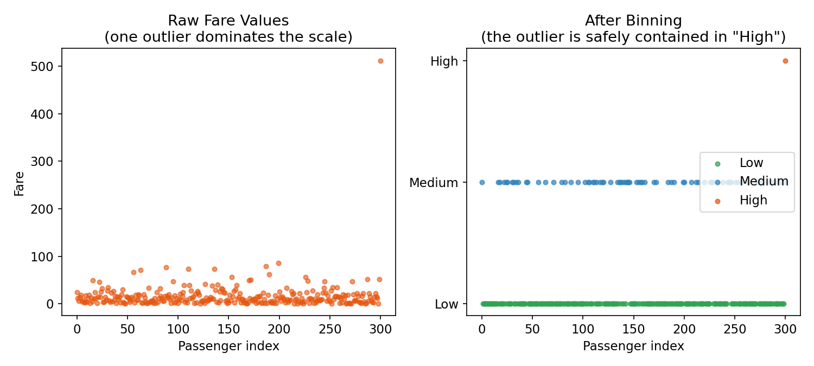
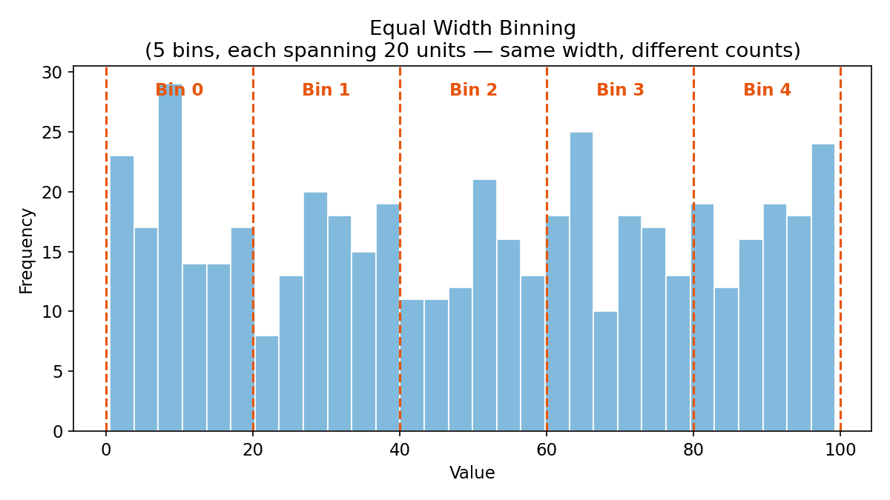
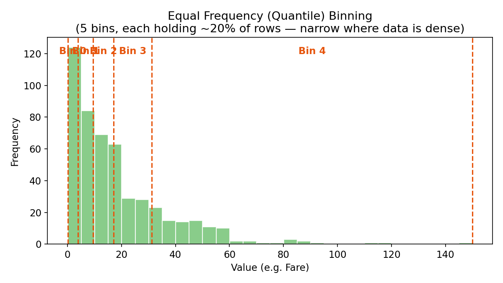
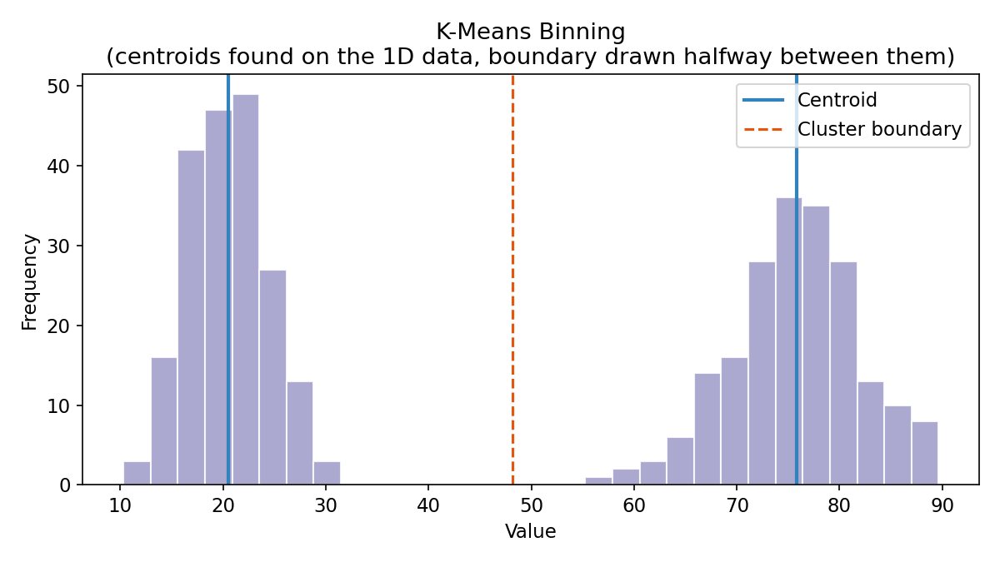
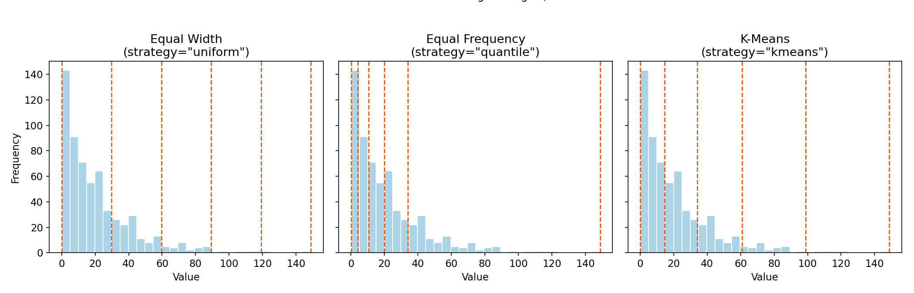
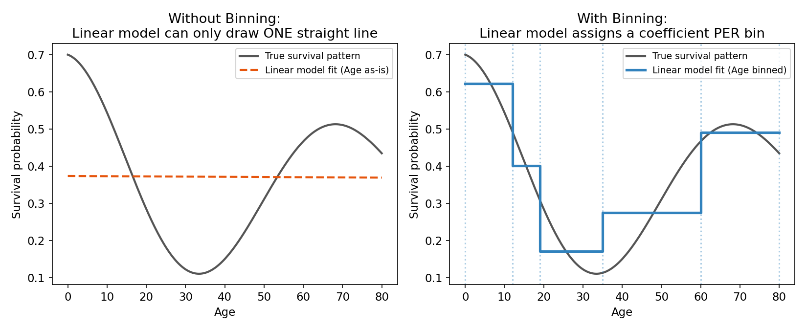
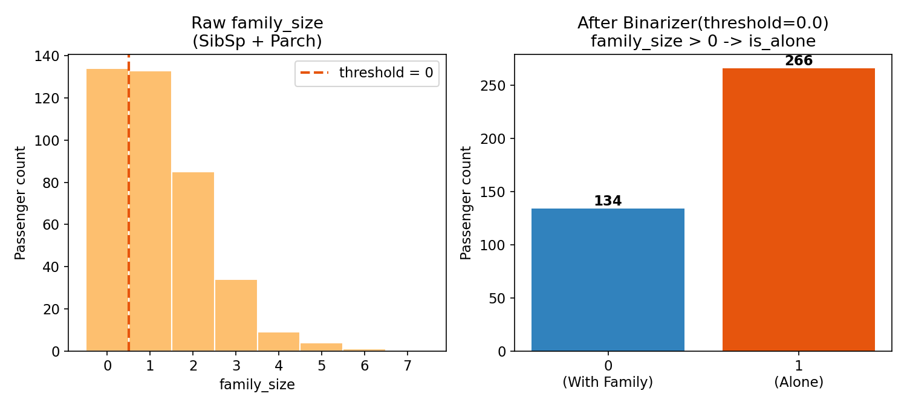
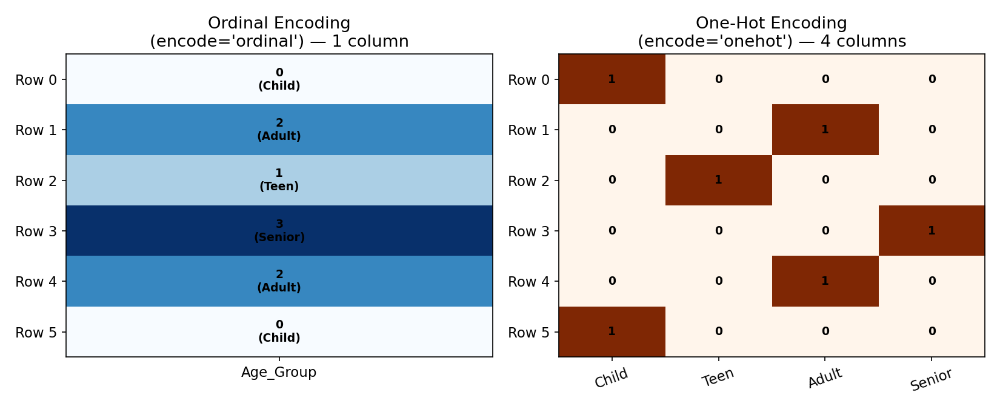

# Day 32: Discretization (Binning) & Binarization
*Feature Engineering — Binning and Binarization (CampusX)*

---

## Table of Contents
1. What is Discretization (Binning)?
2. Why Do We Use Binning?
3. The 3 Types of Unsupervised Binning
4. Side-by-Side: Comparing All 3 Strategies
5. Why Binning Helps Linear Models
6. Custom / Domain-Based Binning
7. Binarization — Deep Dive
8. Encoding Binned Data (One-Hot vs Ordinal)
9. Real-World Datasets for Practice
10. Model vs. Binning Decision Map
11. Quick Reference: Choosing a Strategy
12. Common Pitfalls & Interview Notes

---

## 1. What is Discretization (Binning)?

**Discretization (or Binning)** is the preprocessing technique of converting continuous numerical variables (like `Age` or `Fare`) into discrete categorical intervals (like `Low`, `Medium`, `High`).

### The Big Picture Intuition

Instead of forcing a machine learning model to study tiny, highly precise, and often noisy differences (e.g., the difference in survival between a passenger who is 22.4 vs 22.6 years old), binning groups them together. It tells the model:

> "Treat everyone between 18 and 30 as one single group."

This filters out background mathematical noise, helping models focus on robust patterns rather than memorizing decimal-level coincidences.

**Binning belongs to a broader family of feature engineering steps:**

| Technique | What it does |
|---|---|
| Discretization / Binning | Continuous → multiple ordered categories |
| Binarization | Continuous (or count) → exactly 2 categories (0/1) |
| One-Hot Encoding | Categorical → multiple binary columns |
| Feature Scaling | Continuous → rescaled continuous (not categorical) |

Binning and Binarization are cousins — Binarization is really just binning with `n_bins = 2`.

---

## 2. Why Do We Use Binning? (The Core Reasons)

### Reason 1: To Handle Outliers (Capping)

Extreme outliers can distort models like Linear/Logistic Regression because their optimization math tries to accommodate every single point, including the extreme ones.

- **The Problem:** A single passenger paying a massive ticket `Fare` of ₹512 on the Titanic pulls a linear model's decision boundary out of alignment, even though almost everyone else paid under ₹50.
- **How Binning Fixes It:** Setting up bins (e.g., `0–20 → Low`, `21–100 → Medium`, `101+ → High`) forces that ₹512 value into the `High` bin alongside a ₹150 value. The outlier is safely contained, preventing it from warping the model's coefficients.



*Left: the raw Fare values, with one point completely dominating the scale. Right: after binning, that same passenger simply lands in the "High" category — the model no longer has to stretch its decision boundary to accommodate one extreme number.*

### Reason 2: To Improve Value Spread (Smoothing)

When data is heavily clumped in one area with massive empty gaps elsewhere, models struggle to remain stable.

- **The Problem:** If you have 10 passengers with ages `[22.1, 22.3, 22.5, 22.8, 23.0, 23.1, 23.2, 23.4, 71.0, 72.0]`, there is a massive gap between `23.4` and `71.0`. A model will struggle to make stable predictions in that empty zone.
- **How Binning Fixes It:** By forcing these into 3 equal-frequency bins:

| Bin | Values |
|---|---|
| Bin 0 (Young) | 22.1, 22.3, 22.5, 22.8 |
| Bin 1 (Middle) | 23.0, 23.1, 23.2 |
| Bin 2 (Older) | 23.4, 71.0, 72.0 |

> **Note:** `23.4` ends up in the "Older" bin because equal-frequency binning focuses strictly on equal data **counts** per bin rather than even spacing. This evens out the spread so the model has balanced data across all categories.

### Reason 3: To Prevent Overfitting

High-precision decimal numbers encourage decision trees to make hyper-specific splits (e.g., `Age <= 23.37`). Binning acts as a **regularizer**, forcing the model to learn stable, generalized categories instead of memorizing specific noisy decimals that won't generalize to new data.

### Reason 4: To Model Non-Linear Relations with Linear Models

Linear models can only draw straight lines. If survival rates go up for children, down for young adults, and up again for seniors, a single continuous feature cannot be mapped effectively by a straight line. Slicing `Age` into discrete categories allows a linear model to assign a unique coefficient to each category, capturing complex, non-linear curves that a single slope never could. *(Fully visualized in Section 5.)*

---

## 3. The 3 Types of Unsupervised Binning (The Nitish Framework)

In **unsupervised binning**, the algorithm splits the data without looking at your target output column (`y`). It evaluates only the feature distribution (`X`).

### I. Equal Width (Uniform) Binning

- **The Logic:** Divides the entire range of data from minimum to maximum into `n` intervals of completely equal **width**.
- **The Math:** `bin_width = (max - min) / n`
- **Distribution Example:** Best suited for a **Uniform Distribution**, where data points are spread out evenly like a flat line across their range (e.g., rolling a fair die multiple times).
- **Major Pitfall:** If there is a massive outlier, the "Maximum" value skyrockets, forcing almost all normal data points into the very first bin, while the remaining bins sit completely empty.



*Notice the bin boundaries (orange dashed lines) are all exactly the same width apart — but because the underlying data isn't perfectly uniform, the bins can still end up holding very different numbers of points.*

### II. Equal Frequency (Quantile) Binning

- **The Logic:** Divides the data such that every single bin contains roughly the **same number of data points** (rows).
- **Distribution Example:** Best suited for highly **Skewed Distributions** (like `Fare` or `Income` data, where many people are clustered at the low end and a few are at the high end).
- **How it looks:** The bin *widths* are completely uneven. Dense areas get very narrow bins, while sparse areas get very wide bins.



*Each of the 5 bins holds about 20% of the rows. Notice how narrow Bin 0–2 are (data is dense there) compared to how wide Bin 4 is (data is sparse out in the tail).*

### III. K-Means Binning

- **The Logic:** Runs a 1D clustering algorithm (K-Means) on your numerical column. It groups data points that are mathematically close to one another into clusters.
- **How it works:** Centroids are found for each cluster, and boundaries are drawn halfway between adjacent centroids.
- **Distribution Example:** Best suited for **Multimodal (Bimodal) Distributions**, where your data naturally has multiple distinct peaks or clusters (e.g., geyser eruption intervals).



*The two blue lines mark the discovered centroids; the orange dashed line is the boundary K-Means draws exactly halfway between them — this is very different from equal-width or equal-frequency binning, which would ignore the natural gap between the two humps.*

---

## 4. Side-by-Side: Comparing All 3 Strategies

The choice of strategy isn't just theoretical — running all three on the *exact same* skewed dataset produces noticeably different bin boundaries:



- **Equal Width** places boundaries evenly across the full range — but since this data is skewed, most points get crammed into the first bin or two.
- **Equal Frequency** compresses boundaries where data is dense and stretches them where data is sparse, giving every bin a fair share of rows.
- **K-Means** finds its own natural break points based on where the data actually clusters, which may not divide the data evenly at all.

**Takeaway:** always plot your feature's distribution first (`df['col'].hist()` or a KDE plot) before picking a strategy — the "right" choice depends entirely on the shape of the data.

---

## 5. Why Binning Helps Linear Models Capture Non-Linear Patterns

This is one of the most important — and most interview-relevant — reasons to bin a feature before feeding it to a linear/logistic regression model.



- **Left (no binning):** A linear model can only fit `y = m*Age + c` — one straight line through the whole relationship. If the true survival pattern rises, falls, then rises again with age, a single slope can never capture that.
- **Right (with binning):** Once `Age` is split into bins (`Child`, `Teen`, `Adult`, `Senior`, ...) and one-hot/ordinal encoded, the linear model effectively gets to learn a **separate coefficient per bin**. The resulting fit becomes a step function that can track ups and downs the raw feature never could.

This is exactly why tree-based models (which split thresholds naturally) benefit *less* from binning than linear models do — trees can already carve out non-linear regions on their own.

---

## 6. Custom / Domain-Based Binning

- **The Logic:** Real-world domain logic determines the boundaries, not an algorithm. Use this when you (or domain experts) already know meaningful cutoffs — e.g., legal adulthood, retirement age, tax brackets.
- **How to implement:** Use Pandas' built-in `pd.cut()` function to manually set the cuts:

```python
import pandas as pd

bins = [0, 12, 19, 59, 100]
labels = ['Child', 'Teenager', 'Adult', 'Senior']
df['Age_Group'] = pd.cut(df['Age'], bins=bins, labels=labels)
```

- `pd.cut()` is **equal-width by boundary you define manually** — it does NOT compute anything statistically; you supply the cut points directly.
- Use `pd.qcut()` instead if you want *pandas* to auto-compute equal-frequency cuts without scikit-learn:

```python
df['Fare_Group'] = pd.qcut(df['Fare'], q=4, labels=['Low', 'Mid', 'High', 'VeryHigh'])
```

---

## 7. Binarization — Deep Dive

### 7.1 What is Binarization?

**Binarization** is the extreme, special case of binning where you collapse a continuous (or count-based) feature into **exactly 2 categories**: `0` or `1`, based on a single threshold.

```
value <= threshold  →  0
value  > threshold  →  1
```

It's conceptually identical to `KBinsDiscretizer(n_bins=2)`, but scikit-learn gives it a dedicated, lightweight transformer because it's such a common operation (especially for creating flag/indicator features).

### 7.2 How to Implement It

```python
from sklearn.preprocessing import Binarizer

# family_size = SibSp + Parch  (number of family members aboard, excluding self)
binarizer = Binarizer(threshold=0.0)
df['is_alone'] = binarizer.fit_transform(df[['family_size']])
# family_size == 0        -> is_alone = 0   (traveling WITH family)
# family_size  > 0         -> is_alone = 1   (traveling ALONE)
```

> ⚠️ **Careful with the direction!** `Binarizer` sets values **greater than** the threshold to `1`, and values **less than or equal to** the threshold to `0`. If you want "0 family members = alone", make sure your threshold and interpretation line up — a common beginner mistake is inverting this logic.

### 7.3 Visual Example



*Left: the raw `family_size` distribution — most passengers traveled with 0, 1, or 2 family members, with a long tail. Right: after applying `Binarizer(threshold=0.0)`, everyone collapses into just two buckets — "with family" vs "alone" — which is often a much stronger, cleaner signal for survival prediction than the raw count.*

### 7.4 Where Binarization Is Used in Practice

| Use Case | Continuous/Count Feature | Binarized Output |
|---|---|---|
| Titanic survival | `family_size` (SibSp + Parch) | `is_alone` |
| Spam detection | Word frequency count | `word_present` (0/1) |
| Fraud detection | Transaction count in last hour | `is_high_frequency` |
| Recommendation systems | Number of times a user viewed an item | `has_interacted` |
| Text mining (Bag-of-Words) | Term frequency count | Binary term presence |
| Medical diagnosis | Lab test numeric value | `is_abnormal` (above/below clinical threshold) |

### 7.5 Binarization vs Binning — Key Differences

| Aspect | Binning (n_bins > 2) | Binarization (exactly 2 bins) |
|---|---|---|
| Output categories | 3 or more | Exactly 2 (0/1) |
| Typical use | Capturing graded/ordinal effects (Low/Med/High) | Creating a simple yes/no flag |
| Information retained | More nuance preserved | Maximum information loss — most aggressive simplification |
| Common transformer | `KBinsDiscretizer`, `pd.cut`, `pd.qcut` | `Binarizer`, or `(df['col'] > threshold).astype(int)` |
| Threshold source | Multiple boundaries (algorithm or domain-defined) | Single boundary (usually domain-defined) |

### 7.6 Choosing a Good Threshold

Since Binarization is almost always **domain-driven** (unlike Equal Width/Frequency/K-Means binning, which are algorithmic), picking the right threshold matters a lot:

- **Business logic threshold** — e.g., `is_alone` at `family_size == 0`, or `is_adult` at `Age >= 18`.
- **Statistical threshold** — e.g., binarize at the median or mean to create a balanced 50/50 split.
- **Clinical/scientific threshold** — e.g., blood pressure above a medically defined cutoff → `is_hypertensive`.
- **Target-informed threshold (supervised)** — pick the threshold that best separates the target classes (this technically becomes *supervised* binning, using something like a decision tree stump or information gain to find the optimal split point).

### 7.7 A Simple Pandas-Only Alternative

You don't strictly need scikit-learn for binarization — plain pandas works too, and is often clearer for one-off flags:

```python
df['is_alone'] = (df['family_size'] == 0).astype(int)
df['is_adult'] = (df['Age'] >= 18).astype(int)
df['high_fare'] = (df['Fare'] > df['Fare'].median()).astype(int)
```

Use `sklearn.Binarizer` instead when you need it inside a `Pipeline`/`ColumnTransformer` so it fits consistently within a reusable, production-ready preprocessing flow.

---

## 8. Encoding Binned Data (One-Hot vs Ordinal)

Once data is binned (into 2 or more categories), you must **encode** the bins because models only understand numbers.



- **Ordinal Encoding (`encode='ordinal'`)**
  - Keeps a single column and outputs the raw bin index numbers (`0, 1, 2, ...`).
  - **Best for:** Decision Trees and Random Forests. Trees can split directly on ordinal integers, keeping your dataset compact without adding extra columns.

- **One-Hot Encoding (`encode='onehot'`)**
  - Creates a new binary column for each bin.
  - **Best for:** Linear models, as it prevents the model from assuming a mathematical scale between categories (e.g., that "High" is mathematically "3x" as important as "Low" just because 2 > 0).

### Scikit-Learn Implementation

```python
from sklearn.preprocessing import KBinsDiscretizer
from sklearn.compose import ColumnTransformer

# KBinsDiscretizer handles both binning and encoding in one step
age_binner = KBinsDiscretizer(n_bins=5, encode='ordinal', strategy='quantile')

preprocessor = ColumnTransformer([
    ('bin_age', age_binner, ['Age'])
], remainder='passthrough')
```

**Key `KBinsDiscretizer` parameters at a glance:**

| Parameter | Options | What it controls |
|---|---|---|
| `n_bins` | integer | How many bins to create |
| `strategy` | `'uniform'`, `'quantile'`, `'kmeans'` | Which of the 3 binning types above to use |
| `encode` | `'onehot'`, `'onehot-dense'`, `'ordinal'` | How the resulting bins are represented as numbers |

---

## 9. Real-World Datasets for Practice

To practice binning and binarization, load these datasets in your Jupyter environment:

- **`diabetes.csv`**
  - Practice Column: `Insulin` (heavily skewed). Apply `KBinsDiscretizer` with `strategy='quantile'` to bin it into `Normal`, `Elevated`, and `High` insulin categories.

- **`marketing_campaign.csv`**
  - Practice Column: `Income` (contains heavy outliers). Use `KBinsDiscretizer` to bin income into salary tiers to stabilize your models.

- **Titanic dataset** (referenced throughout this notebook)
  - Practice Columns: `Fare` (binning), `Age` (binning), `family_size = SibSp + Parch` (binarization → `is_alone`).

---

## 10. Model vs. Binning Decision Map

| Model Type | Does it need Binning? | Why? | Best Encoding to Use |
|---|---|---|---|
| Linear / Logistic Regression | Yes (Highly Recommended) | To handle extreme outliers and capture non-linear relationships. | `encode='onehot'` |
| Decision Trees / Random Forests | Optional (For speed/regularization) | Helps prevent overfitting on noisy decimal values. | `encode='ordinal'` |
| Naive Bayes | Yes | Works natively with categorical probabilities. | `encode='onehot'` or `'ordinal'` |
| Deep Learning (Neural Nets) | Yes (Occasionally) | Helps networks identify boundaries faster. | `encode='onehot'` |

---

## 11. Quick Reference: Choosing a Binning Strategy

```
Is your data roughly uniform across its range?
 ├─ Yes → Equal Width Binning (strategy='uniform')
 └─ No
     ├─ Is it heavily skewed (long tail, e.g. Income, Fare)?
     │    └─ Yes → Equal Frequency Binning (strategy='quantile')
     ├─ Does it have multiple distinct "humps" (multimodal)?
     │    └─ Yes → K-Means Binning (strategy='kmeans')
     └─ Do you just need a simple yes/no flag from a count/threshold?
          └─ Yes → Binarization (Binarizer / n_bins=2)
```

---

## 12. Common Pitfalls & Interview Notes

- **Fit on train, transform on test — never fit on the full dataset.** Bin edges (whether from `KBinsDiscretizer` or your own `pd.cut` boundaries) must be learned only from training data to avoid data leakage.
- **Binning discards information.** Every technique here trades precision for stability — always sanity-check that the loss of granularity doesn't hurt performance more than the noise-reduction helps (compare model metrics with vs without binning).
- **`Binarizer` direction confusion.** Remember: `> threshold → 1`, `<= threshold → 0`. Double check this matches your intended semantics.
- **Equal Width is fragile to outliers**, ironically the opposite of what beginners expect — it's Equal *Frequency* that's typically outlier-robust, not Equal Width.
- **K-Means binning is non-deterministic** unless you fix `random_state`, since K-Means itself depends on centroid initialization.
- **Ordinal encoding on non-ordinal-friendly models is risky.** Only use `encode='ordinal'` for models that can naturally handle ordered integers meaningfully (trees) — a plain linear model may wrongly assume bin 3 is "worth more" than bin 1.
- **`pd.cut()` vs `pd.qcut()` vs `KBinsDiscretizer`:** `pd.cut` = manual/custom boundaries, `pd.qcut` = pandas' quantile-based binning, `KBinsDiscretizer` = full scikit-learn control (all 3 strategies + encoding, and pipeline-compatible).

---

### Notes on the images in this notebook

All diagrams (`images/*.png`) are stored in an `images/` subfolder next to this markdown file. As long as that folder travels together with the `.md`/`.ipynb` file (e.g., you keep them zipped together or in the same repo folder), the images will render both in Jupyter's markdown preview and on platforms like GitHub.

**Image index:**
- `equal_width_binning.png`
- `equal_frequency_binning.png`
- `kmeans_binning.png`
- `outlier_capping.png`
- `strategy_comparison.png`
- `linear_model_binning_effect.png`
- `binarization_example.png`
- `encoding_comparison.png`
